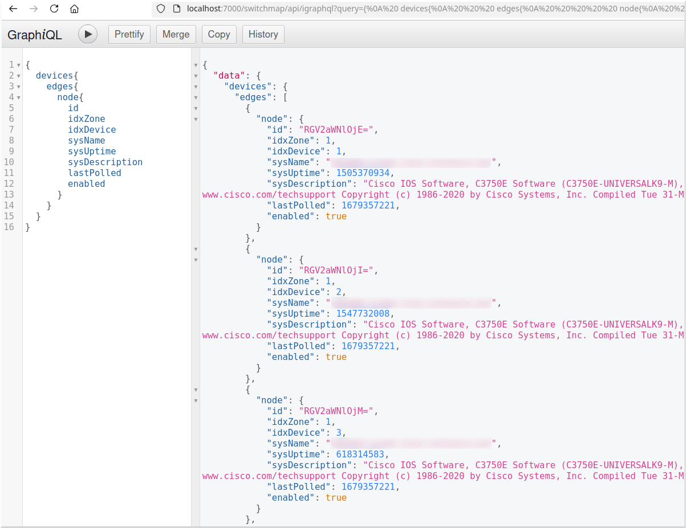

# Testing

Follow the installation steps above to have the application ready, then
add these steps for developing code.

## Making Your System an SNMP Server

Switchmap uses SNMP to gather data from network devices. As a developer it may be difficult to get access to test equipment. This section outlines how to run SNMP on your local machine as an SNMP server.

1. When the server is running and correctly configured, it will provide data about its interfaces via SNMP.
1. You'll need to use an SNMP client to extract the data from the server.

Here are some links to get you started:

1. Windows 11:
    1. SNMP Server: 
        1. Setting up the Server: [Enable SNMP on Windows](https://blog.paessler.com/how-to-enable-snmp-on-your-operating-system)
    1. SNMP Client:
        1. Software: [Net-SNMP Download](http://www.net-snmp.org/download.html)
        1. Tutorial: [SNMP Walk Examples for Windows](https://www.itprc.com/snmpwalk-examples-for-windows/)
1. Ubuntu: 
    1. This page includes both server and client setup.
        1. [Ubuntu SNMP Setup Guide](https://www.digitalocean.com/community/tutorials/how-to-install-and-configure-an-snmp-daemon-and-client-on-ubuntu-18-04#step-3-configuring-the-snmp-agent-server)
    1. Testing configuration example for the `/etc/snmp/snmpd.conf` file.
        1. Add this sample SNMPv2 configuration in the `/etc/snmp/snmpd.conf` file adding the community string `switchmap` with the ability to scan the entire SNMP tree.
            ```
            view switchmap-view  included   .1
            rocommunity  switchmap default -V switchmap-view
            rocommunity6 switchmap default -V switchmap-view
            ```
        1. Restart the `snmpd` daemon.
            ```bash
            $ systemctl restart snmpd
            ```
        1. Test by running this command.
            ```bash
            $ snmpwalk -v2c -c switchmap localhost .1.3.6.1.2.1.2
            ```
        1. You can get more useful information by commenting out the `mibs:` line in the `/etc/snmp/snmp.conf` file. The output of the previous command will be more complete.
            ```
            # Contents of file etc/snmp/snmp.conf
            #mibs :
            ```
        1. Run the command again.
            ```bash
            $ snmpwalk -v2c -c switchmap localhost .1.3.6.1.2.1.2
            ```
        1. Add these configuration parameters to the `etc/config.yaml` file
            ```yaml
                zones:
                    - zone: TEST
                    hostnames:
                        - localhost

                snmp_groups:

                    - group_name: Localhost-Test
                        snmp_version: 2
                        snmp_secname:
                        snmp_community: switchmap
                        snmp_port: 161
                        snmp_authprotocol:
                        snmp_authpassword:
                        snmp_privprotocol:
                        snmp_privpassword:
                        enabled: True
            ```
        1. This testing command for the new `localhost` entry will show results.
            ```bash
            sudo venv/bin/python3 bin/tools/switchmap_poller_test.py --hostname localhost
            ```
## SwitchMap-NG Setup for Developers

Follow the installation steps above to have the application ready, then
add these steps for developing code.

### Database Configuration

Create the `switchmap_unittest` database, and grant privileges to a
`switchmap_unittest` user with the password `switchmap_unittest`.

```bash
$ sudo mysql
```    
``` sql
CREATE DATABASE switchmap_unittest;
GRANT ALL PRIVILEGES ON switchmap_unittest.* TO 'switchmap_unittest'@'localhost' IDENTIFIED BY 'switchmap_unittest';
FLUSH PRIVILEGES;
EXIT;
```
### Setup the Test Config File

Create the testing configuration file which will be stored in a hidden
directory in `$HOME`

```bash
(venv) $ tests/bin/test_db_config_setup.py
```
## Accessing the Web UI Dashboard

The steps for this are simple:

1. Ensure that the poller, ingester, server and dashboard services are all running.
1. Visit the Web UI's Dashboard URL. The URL to access will be:
    ```
    http://localhost:7001/switchmap/
    ```
You can now access the various device screens.

## API Interactive GraphQL Interaction

This is useful for:

1)  Developing queries for API clients.
2)  Troubleshooting your code.
3)  Creating new features.

On the API server you\'ll be able to make GraphQL queries in an easy to
use interactive web page.

1)  Enter your query in the left hand panel
2)  Press the `Play` button
3)  Observe the results

### Interactive GraphQL URL

The steps for this are simple:

1. Ensure that the poller, ingester, server and dashboard services are all running
1. Visit the API's GraphQL URL. The URL to access will be:
    ```
    http://localhost:7000/switchmap/api/igraphql
    ```
You can now do your queries.

### Interactive GraphQL Screenshot

Here is a sample of what to you can do with interactive queries.



## Important File Locations

These locations are important for developers:

### Module Library Layout

Modules are arranged like this:

1)  The API modules are located in `switchmap/server`
2)  The Poller modules are located in `switchmap/poller`
3)  The Web UI modules are located in `switchmap/dashboard`
4)  Modules that are shared with all three are located in
    `switchmap/core`

### Database and GraphQL

Reviewing these files will be important.

1)  The Database SQLAlchemy ORM definitions can be found in the
    `switchmap/server/db/models.py` file.
2)  The GraphQL schema are located in the
    `switchmap/server/db/schema.py` file.
3)  The GraphQL schema attributes are located in the
    `switchmap/server/db/attributes.py` file.

## Run the Test Suite

**NOTE:** The test cases are written to be run only from the root
directory of the repository this to ensure no errors in importing both
the required test and code modules.

You can run all the tests with this command.

```bash
(venv) $ cd /path/to/switchmap
(venv) $ pytest tests/switchmap_
```
```
You can run individual tests with this command.
```bash
(venv) $ cd /path/to/switchmap
(venv) $ pytest tests/switchmap_/path/to/test.py
```
### Populating the Database Using the Ingester

Pollers post network data to the Switchmap-NG server. The Ingester
process reads this posted data and uses it to update the database.

You may not have access to network devices for testing, however there is
test data data that can be imported using the ingester.

An easy way to populate the database using this data is to:

1)  Configure switchmap
2)  Copy the test files in `tests/testdata_` to the configure
    `cache_directory`
3)  Start or restart the poller daemon or app
4)  The updated data should now be visible in the web UI

## Running Tests with Coverage Report

To run the test suite and generate a coverage report, use this command:

```bash
(venv) $ cd /path/to/switchmap
(venv) $ pytest --cov=switchmap --cov-report=lcov:coverage/coverage.lcov --cov-report=term-missing tests/switchmap_
```